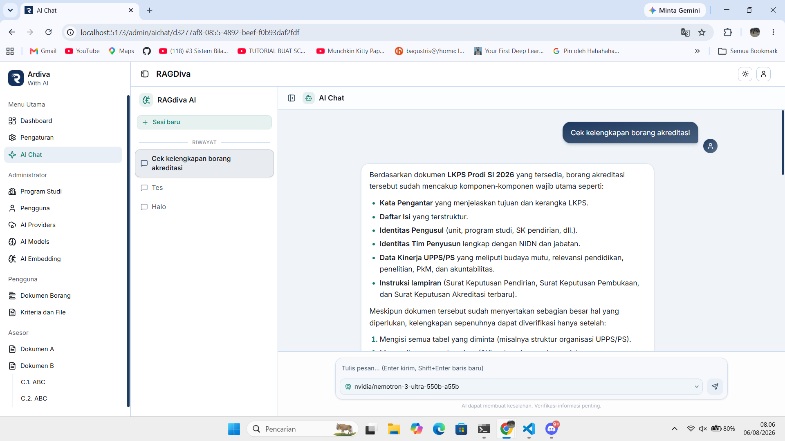

# RAGDiva
> Sistem Informasi Arsip Digital dan Visitasi Akreditasi (Ardiva) yang dilengkapi dengan Retrieval Augmented Generation (RAG)

# Tech Stack
Sistem Informasi ini dibangun menggunakan
- Hono.js sebagai Backend
- Langchain.js sebagai Agentic AI
- Milvus sebagai VectorDB
- MySQL sebagai Database
- Prisma sebagai ORM
- RabbitMQ sebagai Message Broker
- MarkItDown sebagai Document Converter
- React.js sebagai Front End
- Tanstack Routes dan Tanstack Query sebagai Pendukung

# Instalasi
Belum tersedia

# Screenshot
